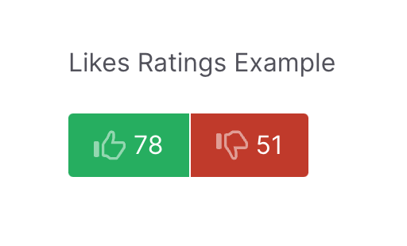
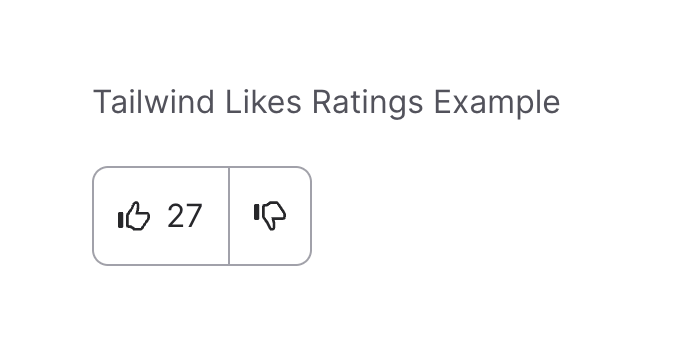

# Likes Ratings Plugin

Likes Ratings is a flexible Grav plugin that displays an "Up" and a "Down" button that can be used for rating content or anything really.  It can be used either via **Twig** or via a **Grav Shortcode**, for maximum flexibility and also provides security options like 'disable after vote' and 'ip restrictions'. The display is fully overridable via a twig template, and you can configure your own layout to mimic any visual UI you could require.  For example, you can mimic Reddit and show a single score rather than the default up and down totals.



This plugin requires the `database` plugin to store scoring in a flat-file Sqlite database. You can use the CLI to see all the scores or a particular scores by passing the 'id' of the item, as well as modifying the scores if required.  

### Configuration

The configuration for the plugin is as follows (`user/plugins/likes-ratings/likes-ratings.yaml`):

```yaml
enabled: true
built_in_css: true                                # Use the built-in CSS of the plugin.

callback: '/likes-ratings'                        # A path that the plugin will look for when processing Ajax calls
twig_template: 'partials/likes-ratings.html.twig' # The twig template to use for rendering the plugin
unique_ip_check: false                            # Ensures that a particular IP can only vote once
disable_after_vote: true                          # Disable the interaction after the user has voted
readonly: false                                   # Set to readonly to disable all interaction
```

You can use the admin or copy the plugin's configuration file to `user/config/plugins/likes-ratings.yaml` and make changes there.

## Usage

### ID

If no ID is provided, Grav will use the current **page route** as the ID (e.g. `/some-path/some-page`).  You can pass any string as an optional ID to either the Twig function or the Grav Shortcode.  e.g. `my-custom-id`.

### Twig

To render the buttons and scores from Twig, you simply need to use the `{{ likes_ratings() }}` function. By default if no ID is provided, Grav will use the current 'page' route as the ID.  

```twig
{{ likes_ratings() }}
```

You can pass any string as an optional ID. For example:

```twig
{{ likes_ratings('my-custom-id') }}
```

This will store the rating under the ID: `my-custom-rating`.  You can then include this Twig code in multiple places and it will always reference the same `my-custom-rating` ID.

You can also pass an optional options array such as `{readonly: false, disable_after_vote: false}`, for example:

```twig
{{ likes_ratings('my-custom-id', {readonly: false, disable_after_vote: false}) }}
```

## Modifying the Twig template 

By default, the plugin will render using the included `templates/partials/likes-ratings.html.twig` file.  This will output a separate button for "Up" with a score for how many Ups the item has received.  It will also include a button for "Down" and a corresponding score for down.  There's also an included simple CSS file that renders these with a couple of SVG images for thumbs up and thumbs down.  You can easily disable the included CSS from the plugins configuration options, and provide your own styling. 

You can simply copy the existing Twig file into your own theme in the same location (`templates/partials/likes-ratings.html.twig`) and make any modifications required.  For example if we wanted to make a layout that was similar to Reddit with an "Up" button with a total, and a "Down" button next to it (without any count) using Tailwind CSS you could do something like this:



```twig


<div class="border rounded-lg border-gray-400 dark:border-gray-100 inline-flex text-gray-800 dark:text-white [&_button_svg_path]:fill-current {{ options.readonly ? 'mouse-events-none [&>button]:cursor-auto' }}" {{ options.readonly ? 'data-likes-readonly' }}  data-likes-ratings="{{ likes_data|json_encode|e('html_attr') }}">
  <button class="border-r border-gray-400 dark:border-gray-100 p-3 flex gap-2 justify-center items-center" data-likes-type="ups">
    <span class="h-4 w-4"></span>
    <span>{{ ups - downs }}</span>
  </button>
  <button class="p-3 flex flex-col gap-1 justify-center items-center" data-likes-type="downs">
    <span class="h-4 w-4"></span>
  </button>
  <div data-likes-error>{{ error }}</div>
</div>
```

Alternatively, you can use a different unique twig template and simply change the `twig_template` option in the plugin configuration.  You can also do this at runtime by passing it via the Twig options array, or via the shortcode syntax.

```twig
{{ likes_ratings('my-custom-id', {twig_template: '/partials/my-custom-likes.html.twig'}) }}
```

### Grav Shortcode

> NOTE: To use the Grav Shortcode, you must first install [shortcode-core](https://github.com/getgrav/grav-plugin-shortcode-core) plugin to provide the base Shortcode functionality. This is not installed by default, because Likes Ratings can be used with Twig without the need of Shortcodes.

To render the buttons and scores from your content using a Grav Shortcode, you can use the `[likes-ratings /]` shortcode.  By default, if no ID is provided, Grav will use the current 'page' route as the ID.  

```markdown
[likes_ratings /]
```


You can pass an optional ID, for example:

```markdown
[likes-ratings id="my-custom-id" /]
```

You can also pass an optional options such as `readonly=false disable_after_vote=false twig_template="partials/tailwind-ratings.html.twig"`, for example:

```twig
[likes-ratings id="my-custom-id" readonly=false disable_after_vote=false /]
```


## CLI Commands

### List (ls)
List the likes-ratings entries. 

Optional Argument is:
1. `id`: The **id** stored in the DB that you want to retrieve.

Options you can pass are:
1. `--limit`: Default, **10** 
2. `--sort`: Can be either **desc** or **asc**. Default, **desc**.
3. `--by`: Can be either **ups** or **downs**. Default, **ups**.

#### Returns only the entry for `foobar`
```
bin/plugin likes-ratings ls foobar
```

#### Returns a full list
```
bin/plugin likes-ratings ls
```

#### Returns a list of 3 entries, sorted by ASC and UPS
```
bin/plugin likes-ratings ls --limit 3 --sort asc --by ups
```

### Set (set)
Sets an amount of ups or downs count for a specified ID entry. 

Required Arguments are:
1. `id`: The **id** stored in the DB that you want to manipulate.
2. `count`: The amount that needs to be changed. Must be a number. If prefixed with `+` or `-`, arithmetic operations will be performed to the values (see examples below).

> Note that prefixing with the `-` requires for your command to be escaped with `--`, see example below.

Options you can pass are:
1. `--type`: Can be either **ups** or **downs**. Default, **ups**.

#### `foobar` will be set to 50 ups (ups: 50, downs: 0)
```
bin/plugin likes-ratings set foobar 50
```

#### `foobar` will be set to 10 downs (ups: 50, downs: 10)
```
bin/plugin likes-ratings set foobar 10 --type downs
```

#### `foobar` will be set to 55 ups (ups: 55, downs: 10)
```
bin/plugin likes-ratings set foobar +5
```

#### `foobar` will be set to 0 downs (ups: 55, downs: 0)

Because `-10` might be interpreted as an option by the CLI, it must be escaped with a `--` like shown below. 
```
bin/plugin likes-ratings set foobar --type downs -- -10
```
